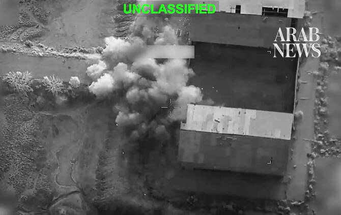

# US carries out more strikes against Iran as Bahrain, Kuwait come under attack

Source: https://www.arabnews.com/node/2650985/middle-east
Captured source: https://www.arabnews.com/node/2650985/middle-east
Published: 2026-07-15T15:13:40+03:00
Modified: 2026-07-15T18:57:47+03:00
Author: Reuters

## Summary

CAIRO/DUBAI: The ​US said it had completed a ‘morning round of strikes’ against Iran on Wednesday after reimposing a naval blockade of Iranian ports, while Iran threatened to shut off more regional energy exports. “CENTCOM launched precision munitions against coastal defense systems and cruise missile storage and launch sites on Greater Tunb Island during the 90-minute wave,”

## Image

## Video Or Embed URLs

- blob:https://www.arabnews.com/32b179d2-ee52-4a8e-9819-ac9819a4442d
- https://imasdk.googleapis.com/js/core/bridge3.777.0_en.html
- https://88e690be0799bfb4b363b98586d96798.safeframe.googlesyndication.com/safeframe/1-0-45/html/container.html
- https://static.addtoany.com/menu/sm.25.html
- about:blank
- https://www.google.com/recaptcha/api2/aframe
- https://cm.g.doubleclick.net/partnerpixels?gdpr=0&us_privacy=1---&gpp_sid=-1&url=https%3A%2F%2Fwww.arabnews.com%2Fnode%2F2650985%2Fmiddle-east

## Downloaded Video

- [03_us-carries-out-more-strikes-against-iran-as-bahrain-kuwait-come-under-.mp4](../../../rendered-clips/2026-07-16/03_us-carries-out-more-strikes-against-iran-as-bahrain-kuwait-come-under-.mp4)

## Text

https://arab.news/57zda

Strikes mark the latest escalation of attacks and counterattacks launched by the two sides as they vie for control of the Strait of Hormuz

CAIRO/DUBAI: The ​US said it had completed a ‘morning round of strikes’ against Iran on Wednesday after reimposing a naval blockade of Iranian ports, while Iran threatened to shut off more regional energy exports.

“CENTCOM launched precision munitions against coastal defense systems and cruise missile storage and launch sites on Greater Tunb Island during the 90-minute wave,” the US ⁠Central Command posted on social media.

The strikes mark the latest escalation of attacks and counterattacks launched by the two sides as they vie for control of the Strait of Hormuz, which carried about a fifth ‌of global oil and ‌gas shipments before the war. “At ​6 ‌a.m. ⁠ET today, ​US ⁠Central Command forces began launching a wave of strikes against Iran,” the US military said.

“The strikes are designed to further degrade military capabilities Iranian forces have used to attack commercial shipping in the Strait of Hormuz.”

The US statement gave no further details and there were no immediate reports of attacks in Iranian media.

Late ⁠on Tuesday the US military said it ‌had hit dozens of military targets near ‌the Strait of Hormuz and Iranian ​coastal areas in strikes lasting ‌seven hours.

In response, Iran’s Islamic Revolutionary Guard Corps said on Wednesday ‌it had struck US military targets in the region, including in Bahrain, Kuwait and Jordan.

It also threatened on Wednesday to shut off more regional energy exports, saying the US “must brace for the closure of all ‌other export corridors that benefit the US and its allies.”

The US has said Iran had ⁠attacked seven ⁠commercial ships over the last week, leading to nearly a dozen crew members being killed, missing or injured.

The war, which began with US and Israeli strikes against Iran on February 28, triggered Iranian attacks on Gulf states that host US bases and caused major disruption to global energy supplies, raising fears of a surge in inflation. Oil prices extended gains by about 1 percent on Wednesday, after settling on Tuesday on a new one-month high.

An interim ceasefire deal in the conflict signed last ​month was meant to lead ​to further negotiations and a permanent truce, but a return to talks has faltered.

Bahrain’s military said it had intercepted aerial attacks from Iran on Wednesday after warning sirens sounded in the early hours in the tiny Gulf nation.

“The General Command of the Bahrain Defense Force announces that Iran continues its systematic hostile approach through its criminal attacks that target civilians,” it said in a statement adding the military “succeeded in intercepting and destroying a number of the treacherous Iranian aerial attacks this morning.”

Kuwait’s military said earlier in the morning that it was intercepting attack drones, and blamed in an “Iranian aggression.”

The continued Iranian aggression on the Gulf states and Jordan came as US forces struck Iran and reimposed a naval blockade on its ports.

President Donald Trump told Fox News on Tuesday he would expand US strikes on Iran next week to target power plants and bridges if Tehran does not make a deal.
