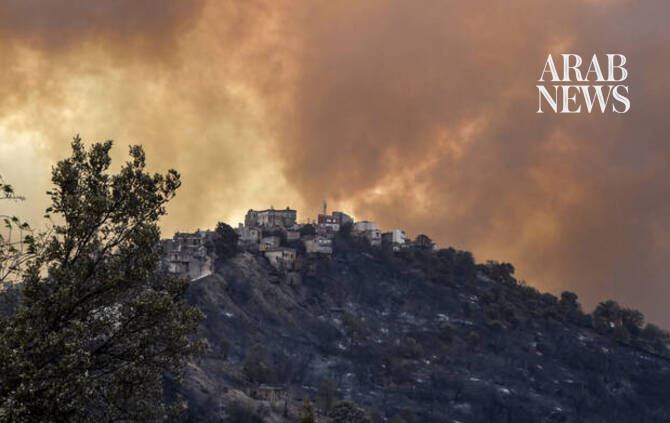

# One dead as Algeria battles wildfires

Source: https://www.arabnews.com/node/2651037/middle-east
Captured source: https://www.arabnews.com/node/2651037/middle-east
Published: 2026-07-16T09:22:58+03:00
Modified: 2026-07-16T09:23:41+03:00
Author: AFP

## Summary

ALGIERS: Wildfires burning across northern Algeria have killed a municipal worker who was taking part in firefighting, media reports said Wednesday. Local media quoted the mayor of Beni Mouhli, in Algeria’s Setif, as saying the 59-year-old died while helping emergency crews contain the fires. The civil defense has yet to confirm the death, but on Tuesday night it said one

## Image

## Video Or Embed URLs

- blob:https://www.arabnews.com/cd91d362-e9cd-42c2-ab00-275fb3eaeefa
- https://imasdk.googleapis.com/js/core/bridge3.777.0_en.html
- https://32129f0df18190702eb202fcb491e2a4.safeframe.googlesyndication.com/safeframe/1-0-45/html/container.html
- https://static.addtoany.com/menu/sm.25.html
- about:blank
- https://www.google.com/recaptcha/api2/aframe
- https://sync.teads.tv/wigo-no-slot
- https://cm.g.doubleclick.net/partnerpixels?gdpr=0&us_privacy=1---&gpp_sid=-1&url=https%3A%2F%2Fwww.arabnews.com%2Fnode%2F2651037%2Fmiddle-east

## Downloaded Video

- [03_one-dead-as-algeria-battles-wildfires.mp4](../../../rendered-clips/2026-07-16/03_one-dead-as-algeria-battles-wildfires.mp4)

## Text

https://arab.news/p3tzu

Wildfires fueled by a heatwave have been ravaging parts of the North African country for days

Authorities have not said how much land had burned

ALGIERS: Wildfires burning across northern Algeria have killed a municipal worker who was taking part in firefighting, media reports said Wednesday. Local media quoted the mayor of Beni Mouhli, in Algeria’s Setif, as saying the 59-year-old died while helping emergency crews contain the fires. The civil defense has yet to confirm the death, but on Tuesday night it said one person with severe burns had been evacuated by helicopter, without identifying the victim. Wildfires fueled by a heatwave have been ravaging parts of the North African country for days. Authorities have not said how much land had burned. Other countries located on the Mediterranean Sea, including France and Italy, have also been battling wildfires in recent days. The Algerian civil defense said in a statement on Wednesday morning that its units had responded to nearly 140 fires across the country over the past 24 hours, and had contained most of them. Wildfires are a common sight in summer in northern Algeria, increasingly exacerbated by drought and heatwaves that scientists say are linked to climate change.
