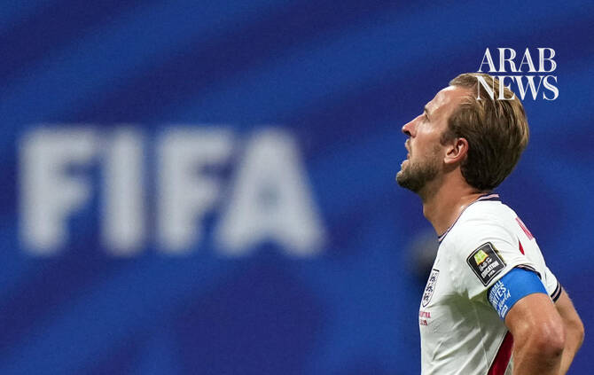

# Harry Kane ‘gutted’ after England crash out of World Cup

Source: https://www.arabnews.com/node/2651121/sport
Captured source: https://www.arabnews.com/node/2651121/sport
Published: 2026-07-16T11:35:40+03:00
Modified: 2026-07-16T11:39:55+03:00
Author: AFP

## Summary

ATLANTA: Harry Kane said he was “gutted” for England and their fans after his team were beaten 2-1 by defending champions Argentina in the World Cup semifinals on Wednesday. Anthony Gordon’s strike had put the Three Lions on the cusp of a first men’s World Cup final since they lifted the 1966 trophy but Lionel Messi inspired a dramatic turnaround in Atlanta. He set up Enzo

## Image

## Video Or Embed URLs

- blob:https://www.arabnews.com/51e829db-8d85-4757-b2ab-6c9f6d7c59b7
- https://imasdk.googleapis.com/js/core/bridge3.777.0_en.html
- https://466b592c6f8bf8775e8d2a55ae99a1b8.safeframe.googlesyndication.com/safeframe/1-0-45/html/container.html
- about:blank
- https://static.addtoany.com/menu/sm.25.html
- https://sync.teads.tv/wigo-no-slot
- https://www.google.com/recaptcha/api2/aframe
- https://cm.g.doubleclick.net/partnerpixels?gdpr=0&us_privacy=1---&gpp_sid=-1&url=https%3A%2F%2Fwww.arabnews.com%2Fnode%2F2651121%2Fsport

## Downloaded Video

- [03_harry-kane-gutted-after-england-crash-out-of-world-cup.mp4](../../../rendered-clips/2026-07-16/03_harry-kane-gutted-after-england-crash-out-of-world-cup.mp4)

## Text

https://arab.news/4c7ah

Bayern Munich forward said England struggled to repel constant attacks from the defending champions

ATLANTA: Harry Kane said he was “gutted” for England and their fans after his team were beaten 2-1 by defending champions Argentina in the World Cup semifinals on Wednesday. For the latest updates, follow us @ArabNewsSport Anthony Gordon’s strike had put the Three Lions on the cusp of a first men’s World Cup final since they lifted the 1966 trophy but Lionel Messi inspired a dramatic turnaround in Atlanta. He set up Enzo Fernandez, who blasted home from outside the area, and provided an inch-perfect cross for Lautaro Martinez’s winner in stoppage time. “Gutted for the boys, gutted for everyone — the team, the staff, the fans,” England captain Kane told the BBC. “We played a good game, the large majority of it. When we went 1-0 up we seemed to try and hold on, which at this level is not enough. “So, just gutted because we’ve worked so hard to be here and the lads have given every last bit of running, blood, sweat, tears.” Bayern Munich forward Kane, who scored six goals during the tournament, said Thomas Tuchel’s men had struggled to repel constant attacks from the defending champions. “After the goal, whether it was them putting more men forward or us not being able to match them man for man, it was just wave after wave,” he said. “Lads were putting blocks in but, in the end, it just wasn’t enough.” He said England had not planned to rely on defending after Gordon’s goal. “When we went ahead the messaging was to go again and get another goal,” he added. “Then once they scored their two goals it was to try and find something but we couldn’t quite get the momentum back in the game.” England have now reached at least the semifinal stage in four of the past five major tournaments, but have still not won a major tournament since the 1966 World Cup. Kane turns 33 later this month and refused to be drawn on whether he imagines still being part of the team by the time the next World Cup comes around. He may be inspired by the performances of Lionel Messi, 39, who has scored eight goals at the 2026 tournament. “As a person, it’s always just about taking it year by year and how I feel,” Kane told reporters. “The England national team is my pride and joy. It’s what I love to do more than anything. “Obviously, four years is a long way away. I’ll be 33 this summer, but as you see on the other hand with Leo there, he’s still performing at the highest level. “I never want to put a limit on these things. But for now, it’s just about processing another tough loss with this team.”

For the latest updates, follow us @ArabNewsSport
