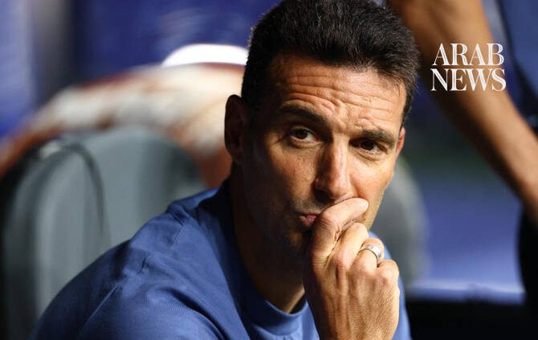

# Argentina smelt ‘blood in water’ in England win: Scaloni

Source: https://www.arabnews.com/node/2651130/sport
Captured source: https://www.arabnews.com/node/2651130/sport
Published: 2026-07-16T12:36:00+03:00
Modified: 2026-07-16T12:37:14+03:00
Author: AFP

## Summary

ATLANTA: Argentina coach Lionel Scaloni saluted his team’s never-say-die mentality after another come-from-behind victory on Wednesday powered them past England into the World Cup final. Scaloni said his team had scented victory as England sat back after taking a 1-0 lead in their semifinal in Atlanta and went for broke to secure a deserved 2-1 win. “I think that this team

## Image

## Video Or Embed URLs

- blob:https://www.arabnews.com/ab7fb7b3-75c8-4e16-9785-7637e441b644
- https://imasdk.googleapis.com/js/core/bridge3.777.0_en.html
- https://409fa71e56d4ae7d1d8d02aef9601206.safeframe.googlesyndication.com/safeframe/1-0-45/html/container.html
- https://static.addtoany.com/menu/sm.25.html
- about:blank
- https://sync.teads.tv/wigo-no-slot
- https://www.google.com/recaptcha/api2/aframe
- https://cm.g.doubleclick.net/partnerpixels?gdpr=0&us_privacy=1---&gpp_sid=-1&url=https%3A%2F%2Fwww.arabnews.com%2Fnode%2F2651130%2Fsport

## Downloaded Video

- [03_argentina-smelt-blood-in-water-in-england-win-scaloni.mp4](../../../rendered-clips/2026-07-16/03_argentina-smelt-blood-in-water-in-england-win-scaloni.mp4)

## Text

https://arab.news/27jbc

Lionel Scaloni said his team had scented victory as England sat back after taking a 1-0 lead in their semifinal

It was the second time in the knockout rounds that Argentina have won after trailing late in the game

ATLANTA: Argentina coach Lionel Scaloni saluted his team’s never-say-die mentality after another come-from-behind victory on Wednesday powered them past England into the World Cup final. For the latest updates, follow us @ArabNewsSport Scaloni said his team had scented victory as England sat back after taking a 1-0 lead in their semifinal in Atlanta and went for broke to secure a deserved 2-1 win. “I think that this team plays the best when we are facing adversity,” Scaloni said. “We had a challenging game, a challenging situation. “There was blood in the water, and we went for it. That’s the feeling that I was getting. “You just have to keep going. We hit the crossbar. We hit the post, and it just couldn’t go in. There’s six or seven chances, but I’m very pleased about that because the team fought to the very end, and I think this is critical.” It was the second time in the knockout rounds that Argentina have won after trailing late in the game following their remarkable last-16 escape act against Egypt — a win Scaloni described at the time as “epic.” Asked how he would describe Wednesday’s victory, Scaloni offered: “Epic, squared?” Scaloni said the win, which sends Argentina into a final showdown against European champions Spain in New Jersey on Sunday, was a team effort. “This group is difficult to explain. It is a show of the collectiveness, the brotherhood that we are in, the the fight to the very end that we have,” Scaloni said. The Argentina coach, who now has the chance to lead the South Americans to four straight major titles after Copa America victories either side of the 2022 World Cup win, said his team had been unfazed as they sought to drag themselves back into the game. “I know the guys. They fear nothing,” he said. “They don’t feel the weight on their shoulders. “They’re playing like they’re seven or eight years old. They’re not thinking about ‘oh, what’s going to happen if we miss or they’re not thinking about the semifinal or final?’”

For the latest updates, follow us @ArabNewsSport
