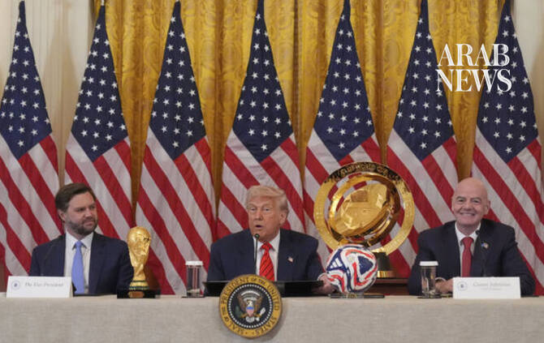

# Trump to attend World Cup final on Sunday: White House

Source: https://www.arabnews.com/node/2651201/sport
Captured source: https://www.arabnews.com/node/2651201/sport
Published: 2026-07-17T09:35:42+03:00
Modified: 2026-07-17T09:35:34+03:00
Author: AFP

## Summary

WASHINGTON: US President Donald Trump will attend Sunday’s World Cup final between Spain and Argentina, the White House said, saving his first appearance at the tournament for its grand finale. “His attendance will cap what has been the most watched, most secure, and most successful World Cup in American history,” Press Secretary Karoline Leavitt told a briefing on Thursday.

## Image

## Video Or Embed URLs

- blob:https://www.arabnews.com/12fecf4e-3133-46c0-856b-2cca70c39c37
- https://imasdk.googleapis.com/js/core/bridge3.777.0_en.html
- https://4ea1e8ea19a2585f95380924e672cb04.safeframe.googlesyndication.com/safeframe/1-0-45/html/container.html
- https://static.addtoany.com/menu/sm.25.html
- about:blank
- https://sync.teads.tv/wigo-no-slot
- https://www.google.com/recaptcha/api2/aframe
- https://cm.g.doubleclick.net/partnerpixels?gdpr=0&us_privacy=1---&gpp_sid=-1&url=https%3A%2F%2Fwww.arabnews.com%2Fnode%2F2651201%2Fsport

## Downloaded Video

- [03_trump-to-attend-world-cup-final-on-sunday-white-house.mp4](../../../rendered-clips/2026-07-17/03_trump-to-attend-world-cup-final-on-sunday-white-house.mp4)

## Text

https://arab.news/r49zz

“His attendance will cap what has been the most watched, most secure, and most successful World Cup in American history,” said Leavitt

Leavitt said she did not know whether Trump would be supporting Argentina or Spain

WASHINGTON: US President Donald Trump will attend Sunday’s World Cup final between Spain and Argentina, the White House said, saving his first appearance at the tournament for its grand finale. For the latest updates, follow us @ArabNewsSport “His attendance will cap what has been the most watched, most secure, and most successful World Cup in American history,” Press Secretary Karoline Leavitt told a briefing on Thursday. “This is a fitting conclusion to a tournament that showcased America’s ability to host the world on the grandest stage.” The US leader will also attend a reception for football’s world governing body FIFA at Trump Tower in New York on Friday, Leavitt said. FIFA President Gianni Infantino had announced in June that Trump would attend the final in New Jersey and present the trophy to the winners, but it had not been confirmed by the White House. Leavitt said she did not know whether Trump would be supporting Argentina or Spain, after he criticized the European nation at a NATO summit last week for failing to help with the Iran war. While Trump has not attended any World Cup games so far, he has been involved in the tournament in a more controversial way. Trump confirmed earlier this month that he asked FIFA’s Infantino to review a decision to hand a red card to star US striker Folarin Balogun during a game against Bosnia. FIFA suspended Balogun’s one-game ban ahead of the Americans’ next match, against Belgium. Despite Balogun’s presence on the field, the hosts were embarrassed in a 4-1 blowout. Trump has repeatedly claimed credit for securing the United States the right to co-host the 2026 World Cup along with Canada and Mexico, a decision made by FIFA in his first term. Infantino has meanwhile cultivated a close relationship with Trump, awarding him with a newly created FIFA peace prize at the World Cup draw in Washington last year, months before the US launched military action against Venezuela and Iran. Letting Trump present the World Cup trophy follows controversy surrounding the presentation of the Club World Cup to English club Chelsea after their victory over Paris Saint-Germain at the same stadium in New Jersey last year. Trump handed the trophy to Chelsea captain Reece James, but then failed to leave the stage, meaning he initially took part in the team’s celebrations alongside bemused players. He later kept a replica of the trophy in his office.

For the latest updates, follow us @ArabNewsSport
