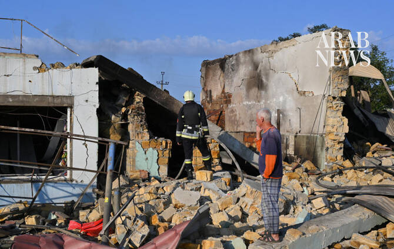

# Two killed as Russian strikes hit Odesa inflicting ‘significant damage’

Source: https://www.arabnews.com/node/2651268/world
Captured source: https://www.arabnews.com/node/2651268/world
Published: 2026-07-17T14:27:28+03:00
Modified: 2026-07-17T14:28:07+03:00
Author: AFP

## Summary

KYIV: A Russian strike on the Black Sea port city of Odesa hit a residential building and killed two people, the deputy mayor of the Ukrainian city said Friday. The official, Oleksandr Filatov, confirmed the fatalities and the missile strike at the scene. Other officials said eight people, including two children, were wounded. Residential buildings, a religious institution, a

## Image

## Video Or Embed URLs

- blob:https://www.arabnews.com/0d049c29-ee59-416b-96e5-a3df2c2fbe99
- https://imasdk.googleapis.com/js/core/bridge3.777.0_en.html
- https://23fda184c05b1efab9749d12d92c007f.safeframe.googlesyndication.com/safeframe/1-0-45/html/container.html
- https://static.addtoany.com/menu/sm.25.html
- about:blank
- https://sync.teads.tv/wigo-no-slot
- https://www.google.com/recaptcha/api2/aframe
- https://cm.g.doubleclick.net/partnerpixels?gdpr=0&us_privacy=1---&gpp_sid=-1&url=https%3A%2F%2Fwww.arabnews.com%2Fnode%2F2651268%2Fworld

## Downloaded Video

- [03_two-killed-as-russian-strikes-hit-odesa-inflicting-significant-damage.mp4](../../../rendered-clips/2026-07-17/03_two-killed-as-russian-strikes-hit-odesa-inflicting-significant-damage.mp4)

## Text

https://arab.news/8xbeg

Strikes from both sides have been intensifying for several months, causing a growing number of civilian casualties

KYIV: A Russian strike on the Black Sea port city of Odesa hit a residential building and killed two people, the deputy mayor of the Ukrainian city said Friday. The official, Oleksandr Filatov, confirmed the fatalities and the missile strike at the scene. Other officials said eight people, including two children, were wounded. Residential buildings, a religious institution, a pre-school facility, vehicles and other civilian infrastructure were damaged in the latest strikes, they said. More than four years after Russia’s invasion of Ukraine, strikes from both sides have been intensifying for several months, causing a growing number of civilian casualties. According to the UN, June was the deadliest month for civilians in Ukraine since April 2022.
