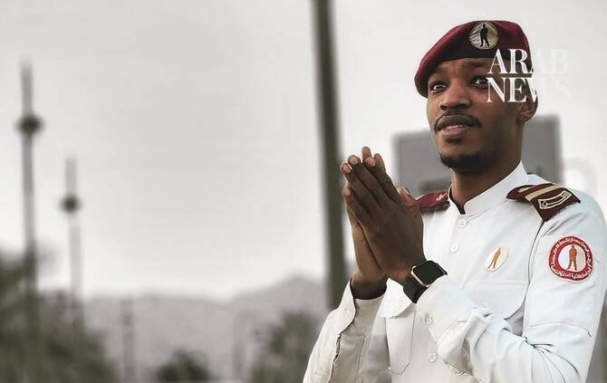

# How Saudi Arabia is saluting security guard after social media bullying

Source: https://www.arabnews.com/node/2651277/saudi-arabia
Captured source: https://www.arabnews.com/node/2651277/saudi-arabia
Published: 2026-07-17T15:13:47+03:00
Modified: 2026-07-17T15:13:47+03:00
Author: Hajar AlQusayer

## Summary

RIYADH: A Saudi security guard who became the target of online mockery has sparked a wider conversation about the dignity of work, with many Saudis rejecting attempts to belittle the profession and describing it as an honorable role that serves both people and the country. Mousa Al-Saad, who has worked in private security over the past nine years, found himself at the center

## Image

## Video Or Embed URLs

- blob:https://www.arabnews.com/085263ee-8000-4f5c-ab29-26d6aea2e92b
- https://imasdk.googleapis.com/js/core/bridge3.777.0_en.html
- https://85103dee0ef7b21bccf6d6cc60419881.safeframe.googlesyndication.com/safeframe/1-0-45/html/container.html
- https://static.addtoany.com/menu/sm.25.html
- about:blank
- https://www.google.com/recaptcha/api2/aframe
- https://cm.g.doubleclick.net/partnerpixels?gdpr=0&us_privacy=1---&gpp_sid=-1&url=https%3A%2F%2Fwww.arabnews.com%2Fnode%2F2651277%2Fsaudi-arabia

## Downloaded Video

- [03_how-saudi-arabia-is-saluting-security-guard-after-social-media-bullyin.mp4](../../../rendered-clips/2026-07-18/03_how-saudi-arabia-is-saluting-security-guard-after-social-media-bullyin.mp4)

## Text

https://arab.news/6apcq

RIYADH: A Saudi security guard who became the target of online mockery has sparked a wider conversation about the dignity of work, with many Saudis rejecting attempts to belittle the profession and describing it as an honorable role that serves both people and the country.

Mousa Al-Saad, who has worked in private security over the past nine years, found himself at the center of the debate after social media users from neighboring countries ridiculed his job. The criticism was met with an outpouring of support across the Kingdom, where many highlighted the responsibilities security guards carry every day.

“People don’t see the struggle behind this work,” Al-Saad told Arab News.

“When something happens inside or outside a facility, the first person to face it is the security guard. We either deal with the problem ourselves or direct it to the relevant authority.”

He said the profession extends beyond standing at the entrance of a building, with security guards often serving as the first point of contact during emergencies, as well as helping visitors.

“The humanitarian side is that I serve my country. I serve this nation and its people,” he said.

Al-Saad added that the job often demands quick decisions in situations the public never sees.

“This job is not as simple as people think,” he said.

“Whether it is crowd management, safety procedures, protecting the facility or protecting the people inside it, what we do is honestly very dangerous work.”

He said security guards are expected to remain calm in difficult situations while putting the safety of others first, despite receiving little recognition.

“You shouldn’t expect recognition for humanitarian work,” he said. “You shouldn’t wait for anything in return.”

Recent events have highlighted the risks associated with the profession.

During attacks targeting Saudi energy facilities, Saudi national Jarrah bin Mohammed Al-Khaldi, an industrial security employee at the Saudi Energy Company, was killed while carrying out his duties.

Following Al-Khaldi’s death, a campaign was launched on the Ehsan platform in the name of Al-Khaldi for the care of orphans.

Al-Saad said the support he received after the online backlash carried a similar message.

“I thank them. I truly thank them,” he said.

“This is the people of Tuwaiq, whether they are standing with me or with someone else. They are one people. This is the people of the Kingdom of Saudi Arabia. May Allah bless them with health and well-being.”

The Ministry of Human Resources and Social Development has also issued workplace guidelines aimed at improving conditions for security guards. The guidance requires employers to provide rest breaks, seating, drinking water, first-aid equipment and other health and safety measures.

Despite the criticism, Al-Saad said the experience has not changed the way he views his work.

“A security guard is a citizen just like everyone else,” he said. “The only difference between us is the job title.”

After nine years in the profession, he said that what keeps him going is passion: “Passion and my love for the security field. My dream has always been to have a military career. That’s what made me love this profession.”

Al-Saad said that his ambition extends beyond himself: “I want to fulfill my mother’s wishes.”

Fawaz Kasab Al-Anzi, a cyberpsychology expert, said the backlash revealed how some people continue to judge others by their profession rather than their contribution to society.

“I believe this issue goes beyond the bullying of one individual,” Al-Anzi told Arab News.

“It reveals a false stereotype toward certain professions and a flaw in the way some people measure a person’s value based on their job title or social status.”

Al-Anzi said psychology explains some of that behavior through what is known as social comparison, where people seek to elevate themselves by diminishing others.

“Some individuals try to strengthen their sense of self-worth by diminishing someone else’s value,” he said, adding that occupational stereotypes often shape public perceptions in ways that fail to reflect the true importance of many professions.

He argued that security guards are frequently misunderstood, with many people overlooking the responsibilities they shoulder.

“A security guard is not merely someone standing at a gate,” he said. “They are a fundamental part of the comprehensive security system and the protection of facilities. They may be the first to detect a threat, the first to report it and the first to respond until the relevant authorities arrive.

“Jobs may differ in their nature and responsibilities,” he added, “but human dignity is not subject to a job hierarchy, and ambition is not reserved for one profession over another.”

Al-Anzi said that social media can quickly amplify ridicule, turning individual comments into collective behavior.

“Bullying in the digital environment may begin with an individual comment, but it quickly turns into collective behavior,” he added.

He described the phenomenon as a form of “digital social contagion,” where users repeat or build on mocking comments after seeing them gain attention.

“The danger is that each person may believe their comment is just a simple word, while the targeted individual may instead face hundreds or even thousands of comments within a short period of time,” he said.

Al-Anzi added that online platforms can strip away empathy, making it easier to forget there is a real person behind every post.

Repeated ridicule can also have consequences beyond the individual, Al-Anzi said, creating what psychologists describe as “occupational stigma” and discouraging young people from pursuing professions society depends on.

“Those working in it may feel that society benefits from their services but does not grant them the respect they deserve,” he said.
